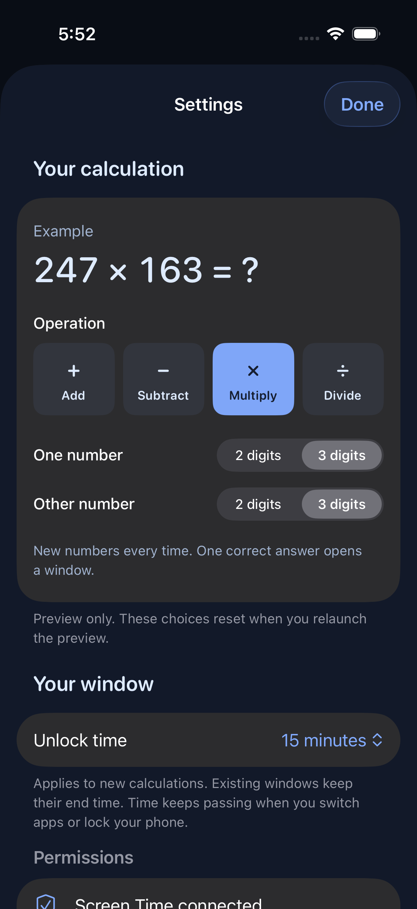
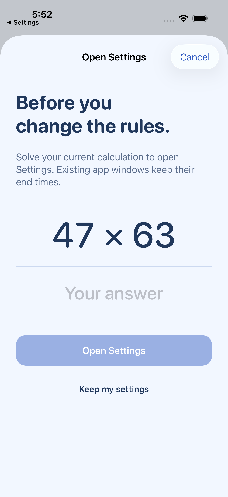
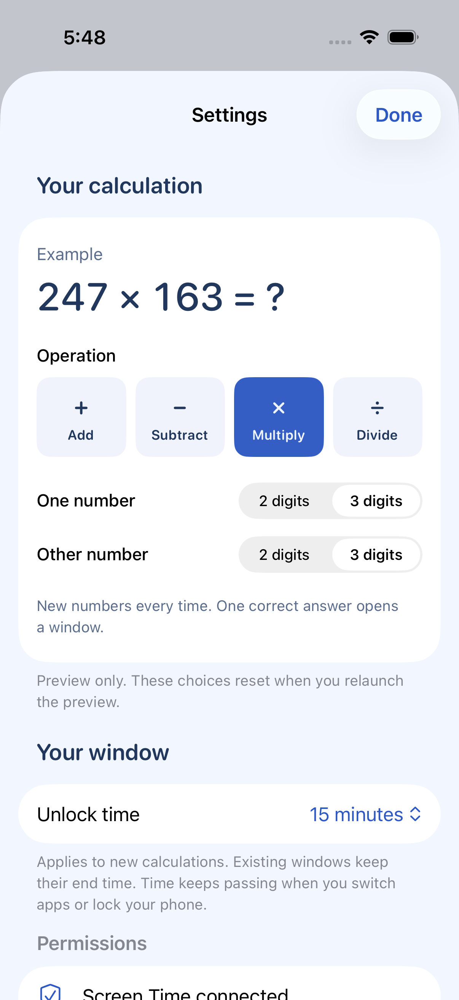
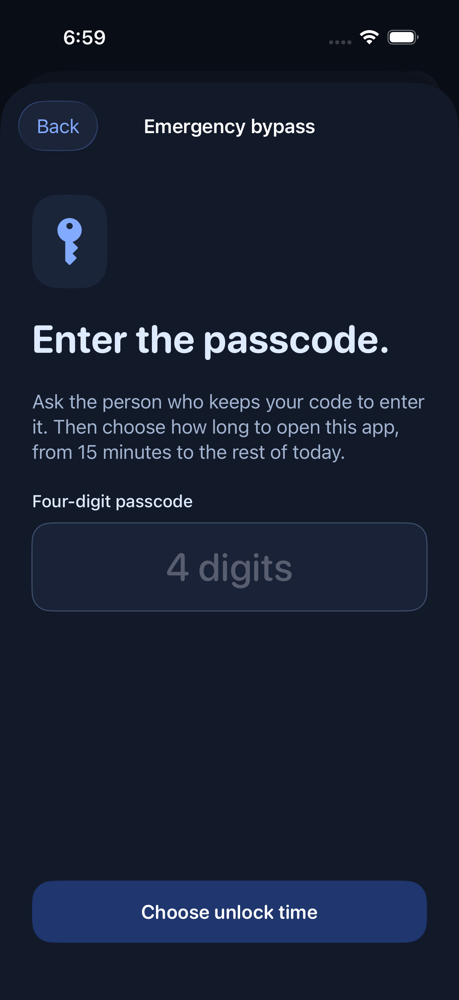
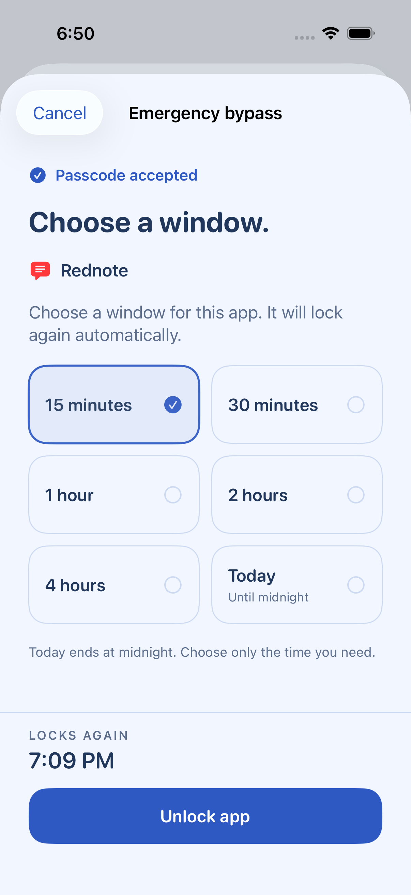
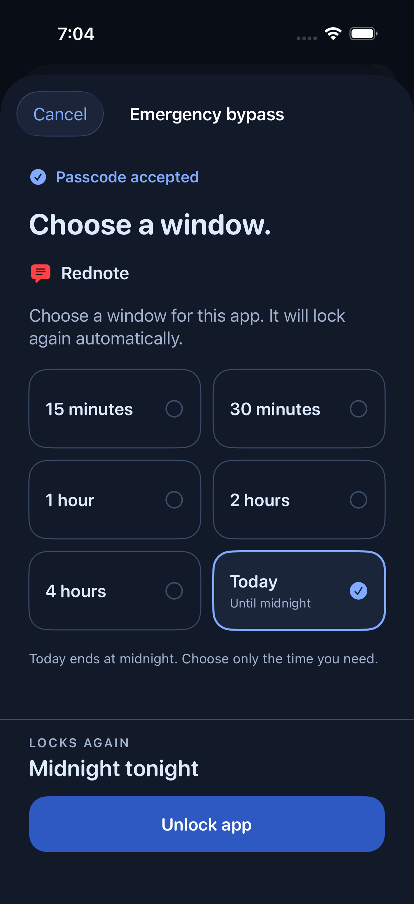
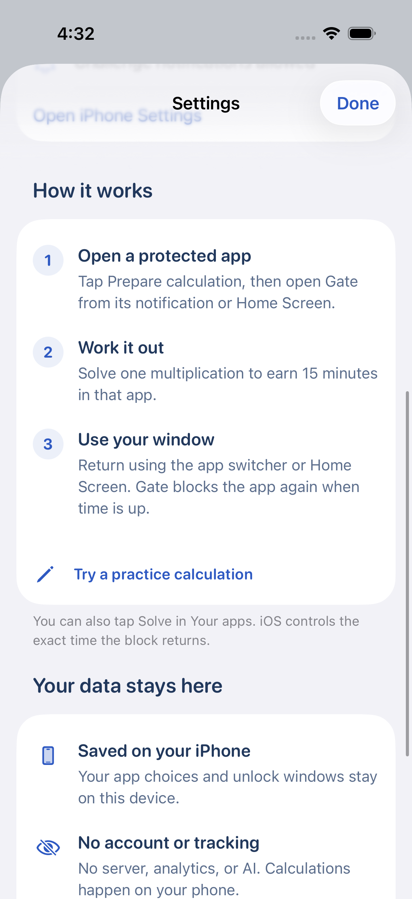
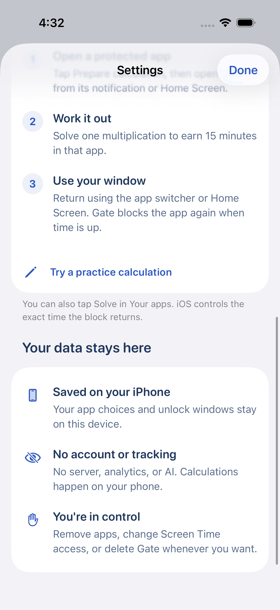
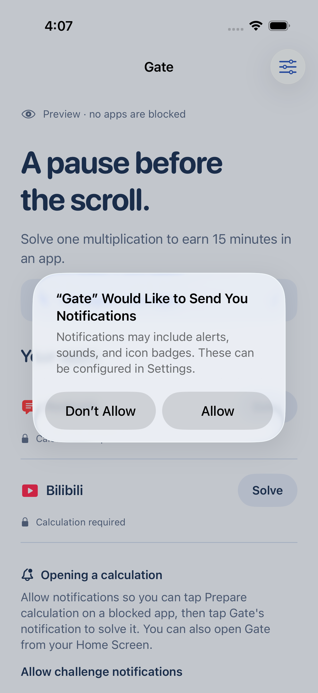
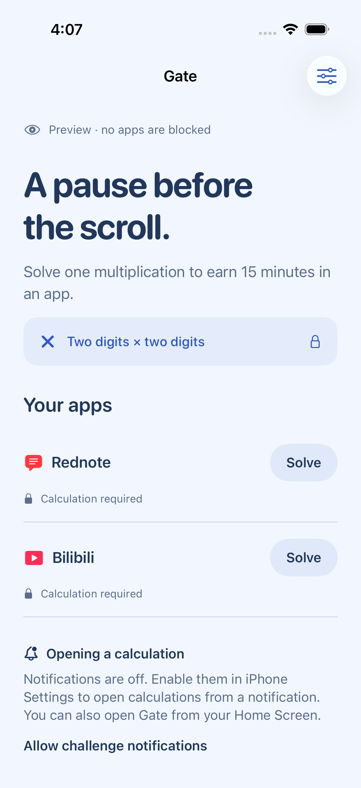

<p align="center">
  
</p>

<h1 align="center">Gate</h1>

<p align="center"><strong>A little math before another scroll.</strong></p>

<p align="center">An iPhone app that makes distracting apps take a little more effort to open.<br>Solve a calculation you choose. Earn a window in one app.</p>

<p align="center"><a href="#try-it-in-the-simulator">Try the preview</a> · <a href="#install-on-your-iphone">Install on iPhone</a> · <a href="docs/design-log.md">How it works</a> · <a href="LICENSE">MIT license</a></p>

## See the flow

| Pick a protected app | Work out the answer | Earn a 15-minute window |
| :---: | :---: | :---: |
| <a href="docs/screenshots/home.png"></a> | <a href="docs/screenshots/challenge.png"></a> | <a href="docs/screenshots/unlocked.png"></a> |

*Actual simulator screenshots with sample apps and the default 15-minute window. Tap a screenshot for full size. Preview mode does not block or unlock real apps.*

<details>
<summary>See dark mode</summary>
<br>


</details>

## What Gate does

1. **Choose your distractions.** Grant Screen Time access and select up to 12 individual apps using Apple's app picker.
2. **Pause at the door.** Opening a protected app brings up an iOS blocking screen. Start a calculation from there, or from Gate's app list.
3. **Solve to unlock.** One correct answer to a random calculation grants access to **that app only**. Two-digit × two-digit multiplication is the default. A wrong answer or cancellation grants nothing.
4. **Use your window.** Your chosen duration starts when you answer correctly. You can leave and reopen the app during that window; time continues while you use other apps or lock your phone.
5. **Block again.** A Screen Time extension reapplies the block when the window expires. You can also end the window early with **Lock now**.

No account, server, analytics, ads, subscriptions, or AI. App selection tokens and unlock dates stay on your phone. Practice calculations never change app access.

### Choose your calculation

**Settings has its own gate.** Tap Settings and solve one calculation using your **current** digit counts and operation before changing anything, or use your configured emergency passcode. Wrong answers, incorrect codes, and cancellation keep Settings closed. Access lasts for that visit: closing Settings or leaving Gate requires a fresh gate next time. Passing the Settings gate never unlocks an app or changes its existing window.

Open **Settings → Your calculation** to choose **Add (+), Subtract (−), Multiply (×), or Divide (÷)**. Set each number to **2 digits or 3 digits** independently: two × two, two × three, three × two, or three × three. The example updates as you choose. **Two-digit multiplication remains the default.**

Subtraction and division put the larger number first. Subtraction never needs a negative answer, and division always produces a whole number with no remainder. For a mixed-size division, the three-digit number comes first regardless of which size control selected it. Division avoids equal-number problems whose answer would always be 1.

Choices are saved on your iPhone and used by new app-unlock, practice, and Settings calculations. Changing preferences does not alter a calculation already open. Existing unlock windows keep their original end time. The labeled simulator preview keeps preferences only until it is relaunched.

<a href="docs/screenshots/settings-gate.png"></a>
<a href="docs/screenshots/settings-calculation.png"></a>

*Simulator previews with sample calculations. No real apps are blocked or unlocked.*

### Emergency bypass

Open **Settings → Emergency bypass → Set up passcode**. Hand your iPhone to a parent or trusted friend so they can choose and confirm a **four-digit code**, including codes that start with zero. There is no default code, and setup is optional.

Once configured, every calculation has an **Emergency bypass** button. Tap it and enter the code to skip the calculation:

- **Protected app:** after the correct code, choose **15 minutes, 30 minutes, 1 hour, 2 hours, 4 hours, or Today (until midnight)**. Review when it will lock again, then tap **Unlock app**. Only that app opens; your normal calculation duration stays unchanged.
- **Settings:** opens Settings for this visit without changing app windows.
- **Practice:** finishes the practice round without unlocking apps.

**Rest of today** ends at the next local midnight, rather than 24 hours later. Timed choices longer than the remaining day disappear. During the last 15 minutes of the day, the only choice is a full 15-minute window, which ends tomorrow. Timed windows start when you confirm; an open picker cannot carry today’s authorization into a new day.

Entering the correct code alone grants nothing. Incorrect codes, canceled entry, and canceling the duration picker all keep the app closed. Leaving Gate clears unfinished entry and duration authorization, refreshes the calculation, and requires the code again. The same saved code works on the new challenge. **Change passcode** and **Turn off emergency bypass** both require the existing code, even if you entered Settings by solving a calculation. If you forget the code, calculations remain available; Gate cannot display the saved code.

The passcode is stored in the iPhone's Keychain with [device-only, unlocked-device accessibility](https://developer.apple.com/documentation/security/ksecattraccessiblewhenunlockedthisdeviceonly). It does not sync through iCloud and is never written to Gate's shared JSON state. The labeled simulator preview uses a temporary in-memory code that resets on relaunch.

| Enter the private code | Choose a window | Open until midnight |
| :---: | :---: | :---: |
|  |  |  |

*Light and dark simulator previews with sample apps. No real apps are blocked or unlocked; no passcode is shown.*

### Leaving a calculation

If you leave Gate during an unfinished calculation, returning gives you **two new numbers and a different answer**. The answer field and retry message reset, so a result found in Calculator cannot unlock the previous round. This applies to app access, practice, and the Settings gate. The operation, digit sizes, and offered unlock duration stay the same.

Completed calculations and active unlock windows are preserved; returning to Gate never restarts their timers.

### Choose your unlock time

Open **Settings → Unlock time** to choose **1, 3, 5, 10, 15, 30, or 60 minutes**. The default is **15 minutes**. Your choice is saved on the phone and applies to new calculations for any protected app. Existing windows keep their original end time.

<a href="docs/screenshots/settings.png"></a>

Settings also includes a three-step guide with a practice calculation, followed by short explanations of where your data stays and what you control.

<details>
<summary>See the guide and privacy notes</summary>
<p>Actual simulator screenshots with sample app data.</p>


</details>

**Status:** an early, open-source build under the MIT license. Core tests and simulator flows pass, and development signing has been verified. **Real-device blocking, handoff, and background expiry still need acceptance testing.** There is no App Store download or prebuilt signed app in this repository.

## How the blocking screen opens Gate

| Build and device | What happens |
| --- | --- |
| iOS 26.5+ SDK **and** iOS 26.5+ on the phone | Tap **Solve to unlock** on the blocking screen to open Gate directly. |
| Older SDK or older iOS | Tap **Prepare calculation**, then tap Gate's notification or open Gate from the Home Screen. |

Notifications are optional. After answering, return to the app using the app switcher or Home Screen. The native flow requires a button tap; Gate does not silently redirect every app launch or install Shortcuts automations.

On the notification-based flow, Gate asks for notification permission after Screen Time setup if you haven't answered before. **Opening a calculation** appears on the home screen only while permission is missing. Once allowed, that block disappears. If you deny permission or later turn notifications off, **Allow challenge notifications** opens iPhone Settings. Gate checks again when you return. You can also reach **Notification settings** from Gate's Settings after granting permission.

<details>
<summary>See notification setup</summary>
<p>Simulator screenshots with sample apps: the first permission request, then guidance after denial. App blocking remains a preview.</p>


</details>

The project generator detects whether the selected SDK provides Apple's [`openParentalControlsApp`](https://developer.apple.com/documentation/managedsettings/shieldactionresponse/openparentalcontrolsapp) API. **Regenerate after switching or updating Xcode.** A newer phone alone cannot enable an API missing from the SDK used to build the app.

## Try it in the simulator

You need a Mac with Xcode and its command-line tools, an installed iPhone simulator running iOS 17 or later, Python 3, and [XcodeGen](https://github.com/yonaskolb/XcodeGen). The current build was tested with Xcode 26.3. No third-party runtime packages are used.

```bash
git clone https://github.com/nuynait/screen-time-enhancement.git
cd screen-time-enhancement
brew install xcodegen
./scripts/run-simulator.sh
```

The script builds the app, selects a running iPhone simulator or the newest compatible installed runtime, and opens the labeled preview. **No Apple Developer account or signing setup is needed for the preview.** To choose a particular simulator:

```bash
xcrun simctl list devices available
./scripts/run-simulator.sh <simulator-udid>
```

If you only want to open the project:

```bash
./scripts/generate.sh
open ScreenTimeEnhancement.xcodeproj
```

`project.yml` is the source of truth. XcodeGen creates the ignored `.xcodeproj` and Info.plists. Edit the YAML, then regenerate; don't hand-edit the generated project.

## Install on your iPhone

Real Screen Time controls require a physical iPhone and an Apple Developer Program team that can provision **Family Controls** and **App Groups**. Simulator preview mode does not test these permissions. See [Apple's capability setup](https://developer.apple.com/documentation/xcode/configuring-family-controls).

### 1. Set your own signing identity

On a fresh checkout:

```bash
cp Config/Local.xcconfig.example Config/Local.xcconfig
```

Edit the new file with your team ID and a unique bundle identifier:

```xcconfig
DEVELOPMENT_TEAM = YOUR_TEAM_ID
GATE_BUNDLE_ID = com.yourname.gate
GATE_APP_GROUP = group.$(GATE_BUNDLE_ID)
```

Replace `YOUR_TEAM_ID` and `yourname` before building for a device. `Config/Local.xcconfig` is ignored by Git and overrides the public simulator defaults. Keep your existing file if you have already configured signing.

### 2. Generate and check the four targets

```bash
./scripts/generate.sh
open ScreenTimeEnhancement.xcodeproj
```

All targets inherit your team and App Group. With the example above, their identifiers are:

| Target | Bundle identifier |
| --- | --- |
| Gate | `com.yourname.gate` |
| GateShieldAction | `com.yourname.gate.shield-action` |
| GateShieldConfiguration | `com.yourname.gate.shield-configuration` |
| GateActivityMonitor | `com.yourname.gate.activity-monitor` |

In **Signing & Capabilities**, verify automatic signing, **Family Controls**, and the same **App Group** on all four targets. Keep your identifiers stable after installation; changing the App Group starts with separate storage.

### 3. Run and choose apps

Select the **Gate** scheme and your connected, unlocked iPhone, then press **⌘R**. In Gate, allow Screen Time access and choose **individual apps inside categories**. Whole categories and websites are not supported.

You can also build a signed development app from the command line:

```bash
./scripts/build-device.sh
```

This allows Xcode to update development provisioning. It builds the app but does not install it automatically.

Before relying on the gate, follow the [physical-device checklist](docs/device-testing.md), including short and default 15-minute windows while Gate is backgrounded. For TestFlight or App Store distribution, Apple requires [Family Controls distribution approval](https://developer.apple.com/documentation/familycontrols/requesting-the-family-controls-entitlement) for the app and each Screen Time extension.

## Limits to understand

- **You stay in control.** You can remove selected apps, revoke Screen Time access, or delete Gate. It adds friction; it is not tamper-proof parental control.
- **iOS owns expiry delivery.** Device Activity callbacks are not guaranteed to fire at an exact second. Apple invokes interval-end callbacks when the device is in use. Gate also reconciles expired windows when reopened.
- **Returning to the app is manual.** Apple provides private selection tokens, not a general API to launch any chosen app. Gate does not guess app URL schemes.
- **Preview is separate from enforcement.** Debug `--demo` uses sample data and never writes real Screen Time settings. An unsigned simulator launch without it can report missing App Group storage; use the preview script.

## Development

```bash
./scripts/test.sh             # Core policy and persistence tests
./scripts/build.sh            # Unsigned simulator app + three extensions
./scripts/test-ui.sh          # Simulator app, Keychain, and UI tests; auto-selects an iPhone
swift scripts/generate-icon.swift
```

Core tests cover all four operations and digit combinations, exact whole-number division, answer validation, every supported duration, per-app access, the expiry boundary, midnight/DST schedule dates, clock rollback, persistence, corruption, concurrent writers, passcode validation and credential failures, and emergency duration limits through local midnight on both daylight-saving transitions. Simulator tests cover Keychain persistence and protection attributes, saved preferences and old-state compatibility, Apple's schedule date resolution, and UI flows for gating Settings on every visit, refreshing unfinished calculations after an app switch, returning from the background, changing calculation settings and duration, wrong/correct answers, emergency bypass and passcode management, duration confirmation and cancellation after verification, and early locking. UI interactions use a deterministic calculation in an explicit Debug preview.

The simulator test script uses local ad-hoc signing so app-hosted Keychain tests can access their isolated test credentials. It needs no developer account. The test action launches Gate with `--demo`; ordinary Run and device installation still launch the real app. You can pass Xcode test filters after an explicit simulator ID, for example `./scripts/test-ui.sh <simulator-udid> -only-testing:GateAppTests`.

The notification test adds `--test-notifications` to `--demo --uitesting` to exercise the real system prompt and Settings handoff while keeping app blocking in preview mode. Ordinary previews never request notification permission. The first test run denies the prompt by default; a fresh test installation with `TEST_RUNNER_GATE_NOTIFICATION_TEST_RESPONSE=allow` exercises granting it. Later runs reuse the OS's saved permission. Per-app notification toggles are unavailable in the tested simulator, so changing those settings and returning to Gate remains a physical-device check.

| Directory | Purpose |
| --- | --- |
| `App/` | SwiftUI setup, protected app list, calculation, countdown, settings |
| `Core/` | Arithmetic, time-window policy, atomic JSON storage with a process lock |
| `Shared/` | App tokens, pending challenges, scheduling, shields, and handoff |
| `Extensions/` | Shield action, shield appearance, and background expiry |
| `Config/` | Shared build settings, entitlements, and signing template |
| `Tests/`, `AppTests/`, `UITests/` | Core tests, app-hosted Keychain/access checks, and simulator flows |
| `docs/` | Design decisions, screenshots, device checklist, and roadmap |

Build products, generated Xcode projects, local signing settings, credentials, provisioning profiles, and machine-specific notes are ignored. Source files, shared entitlement declarations, icon assets, and documentation screenshots are versioned.

See [CONTRIBUTING.md](CONTRIBUTING.md) before changing the gate's timing or persistence rules. Ideas and current scope are in the [roadmap](docs/roadmap.md).

## License

[MIT](LICENSE). You may use, modify, and redistribute the code under that license. Screenshots show sample apps for illustration; Gate is not affiliated with them.
