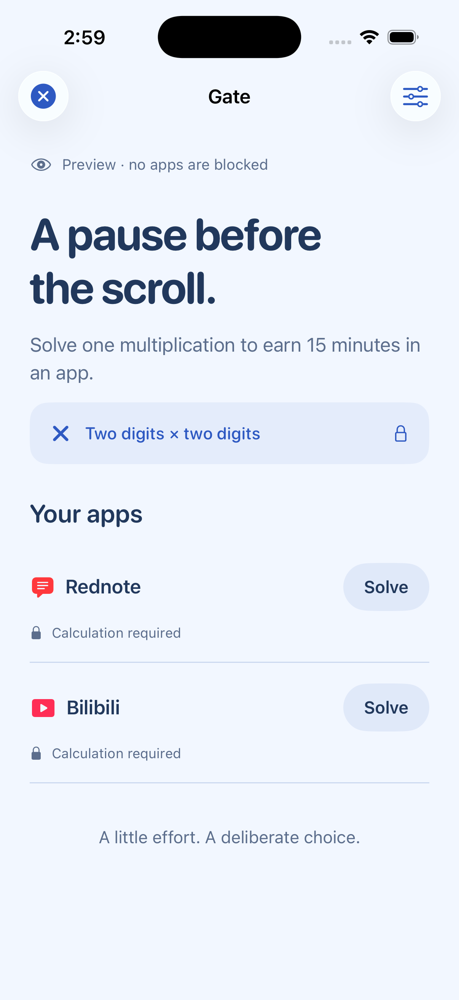
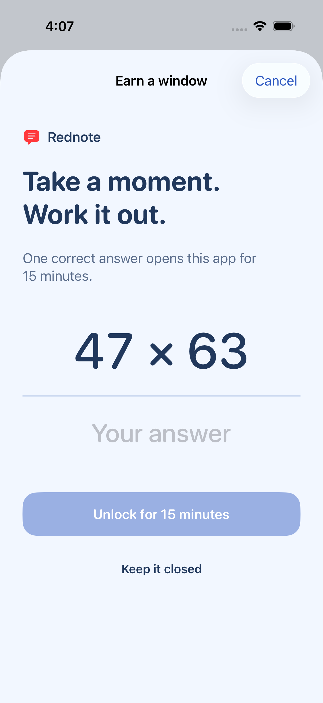
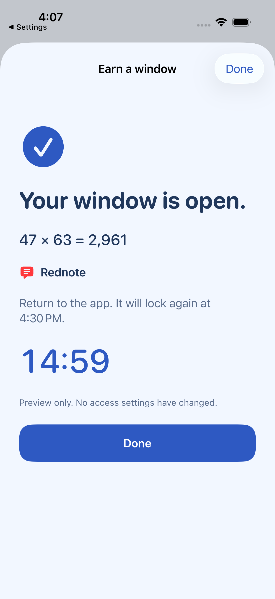
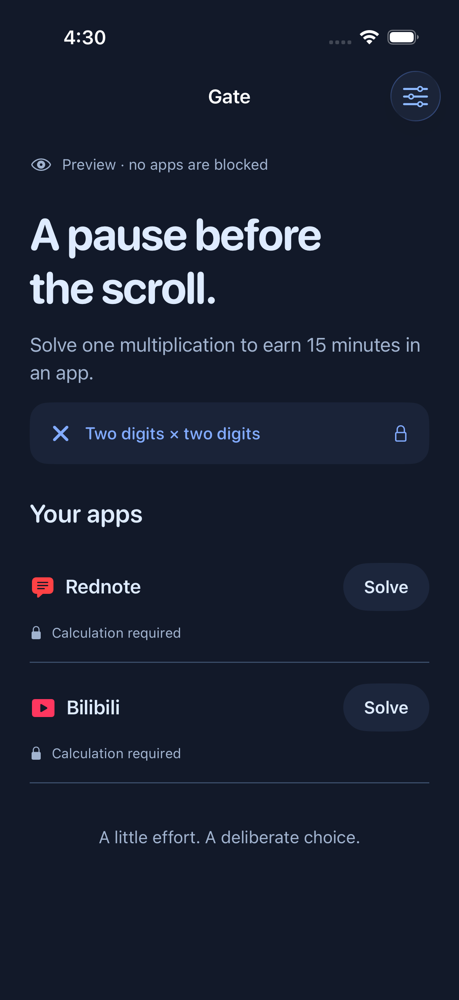
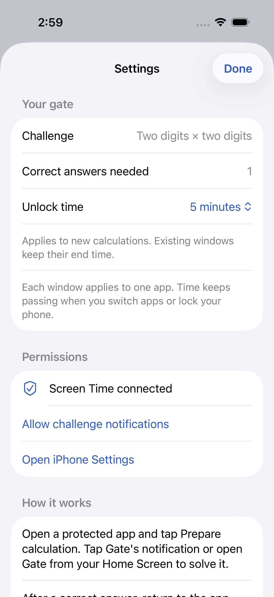

<p align="center">
  
</p>

<h1 align="center">Gate</h1>

<p align="center"><strong>A little math before another scroll.</strong></p>

<p align="center">An iPhone app that makes distracting apps take a little more effort to open.<br>Solve a two-digit multiplication problem. Earn a window in one app.</p>

<p align="center"><a href="#try-it-in-the-simulator">Try the preview</a> · <a href="#install-on-your-iphone">Install on iPhone</a> · <a href="docs/design-log.md">How it works</a> · <a href="LICENSE">MIT license</a></p>

## See the flow

| Pick a protected app | Work out the answer | Earn a 15-minute window |
| :---: | :---: | :---: |
| <a href="docs/screenshots/home.png"></a> | <a href="docs/screenshots/challenge.png"></a> | <a href="docs/screenshots/unlocked.png"></a> |

*Actual simulator screenshots with sample apps and the default 15-minute window. Tap a screenshot for full size. Preview mode does not block or unlock real apps.*

<details>
<summary>See dark mode</summary>
<br>

</details>

## What Gate does

1. **Choose your distractions.** Grant Screen Time access and select up to 12 individual apps using Apple's app picker.
2. **Pause at the door.** Opening a protected app brings up an iOS blocking screen. Start a calculation from there, or from Gate's app list.
3. **Solve to unlock.** One correct answer to a random two-digit × two-digit problem grants access to **that app only**. A wrong answer or cancellation grants nothing.
4. **Use your window.** Your chosen duration starts when you answer correctly. You can leave and reopen the app during that window; time continues while you use other apps or lock your phone.
5. **Block again.** A Screen Time extension reapplies the block when the window expires. You can also end the window early with **Lock now**.

No account, server, analytics, ads, subscriptions, or AI. App selection tokens and unlock dates stay on your phone. Practice calculations never change app access.

### Choose your unlock time

Open **Settings → Unlock time** to choose **1, 3, 5, 10, 15, 30, or 60 minutes**. The default is **15 minutes**. Your choice is saved on the phone and applies to new calculations for any protected app. Existing windows keep their original end time.

<a href="docs/screenshots/settings.png"></a>

**Status:** an early, open-source build under the MIT license. Core tests and simulator flows pass, and development signing has been verified. **Real-device blocking, handoff, and background expiry still need acceptance testing.** There is no App Store download or prebuilt signed app in this repository.

## How the blocking screen opens Gate

| Build and device | What happens |
| --- | --- |
| iOS 26.5+ SDK **and** iOS 26.5+ on the phone | Tap **Solve to unlock** on the blocking screen to open Gate directly. |
| Older SDK or older iOS | Tap **Prepare calculation**, then tap Gate's notification or open Gate from the Home Screen. |

Notifications are optional. After answering, return to the app using the app switcher or Home Screen. The native flow requires a button tap; Gate does not silently redirect every app launch or install Shortcuts automations.

The project generator detects whether the selected SDK provides Apple's [`openParentalControlsApp`](https://developer.apple.com/documentation/managedsettings/shieldactionresponse/openparentalcontrolsapp) API. **Regenerate after switching or updating Xcode.** A newer phone alone cannot enable an API missing from the SDK used to build the app.

## Try it in the simulator

You need a Mac with Xcode and its command-line tools, an installed iPhone simulator running iOS 17 or later, Python 3, and [XcodeGen](https://github.com/yonaskolb/XcodeGen). The current build was tested with Xcode 26.3. No third-party runtime packages are used.

```bash
git clone https://github.com/nuynait/screen-time-enhancement.git
cd screen-time-enhancement
brew install xcodegen
./scripts/run-simulator.sh
```

The script builds the app, selects a running iPhone simulator or the newest compatible installed runtime, and opens the labeled preview. **No Apple Developer account or signing setup is needed for the preview.** To choose a particular simulator:

```bash
xcrun simctl list devices available
./scripts/run-simulator.sh <simulator-udid>
```

If you only want to open the project:

```bash
./scripts/generate.sh
open ScreenTimeEnhancement.xcodeproj
```

`project.yml` is the source of truth. XcodeGen creates the ignored `.xcodeproj` and Info.plists. Edit the YAML, then regenerate; don't hand-edit the generated project.

## Install on your iPhone

Real Screen Time controls require a physical iPhone and an Apple Developer Program team that can provision **Family Controls** and **App Groups**. Simulator preview mode does not test these permissions. See [Apple's capability setup](https://developer.apple.com/documentation/xcode/configuring-family-controls).

### 1. Set your own signing identity

On a fresh checkout:

```bash
cp Config/Local.xcconfig.example Config/Local.xcconfig
```

Edit the new file with your team ID and a unique bundle identifier:

```xcconfig
DEVELOPMENT_TEAM = YOUR_TEAM_ID
GATE_BUNDLE_ID = com.yourname.gate
GATE_APP_GROUP = group.$(GATE_BUNDLE_ID)
```

Replace `YOUR_TEAM_ID` and `yourname` before building for a device. `Config/Local.xcconfig` is ignored by Git and overrides the public simulator defaults. Keep your existing file if you have already configured signing.

### 2. Generate and check the four targets

```bash
./scripts/generate.sh
open ScreenTimeEnhancement.xcodeproj
```

All targets inherit your team and App Group. With the example above, their identifiers are:

| Target | Bundle identifier |
| --- | --- |
| Gate | `com.yourname.gate` |
| GateShieldAction | `com.yourname.gate.shield-action` |
| GateShieldConfiguration | `com.yourname.gate.shield-configuration` |
| GateActivityMonitor | `com.yourname.gate.activity-monitor` |

In **Signing & Capabilities**, verify automatic signing, **Family Controls**, and the same **App Group** on all four targets. Keep your identifiers stable after installation; changing the App Group starts with separate storage.

### 3. Run and choose apps

Select the **Gate** scheme and your connected, unlocked iPhone, then press **⌘R**. In Gate, allow Screen Time access and choose **individual apps inside categories**. Whole categories and websites are not supported.

You can also build a signed development app from the command line:

```bash
./scripts/build-device.sh
```

This allows Xcode to update development provisioning. It builds the app but does not install it automatically.

Before relying on the gate, follow the [physical-device checklist](docs/device-testing.md), including short and default 15-minute windows while Gate is backgrounded. For TestFlight or App Store distribution, Apple requires [Family Controls distribution approval](https://developer.apple.com/documentation/familycontrols/requesting-the-family-controls-entitlement) for the app and each Screen Time extension.

## Limits to understand

- **You stay in control.** You can remove selected apps, revoke Screen Time access, or delete Gate. It adds friction; it is not tamper-proof parental control.
- **iOS owns expiry delivery.** Device Activity callbacks are not guaranteed to fire at an exact second. Apple invokes interval-end callbacks when the device is in use. Gate also reconciles expired windows when reopened.
- **Returning to the app is manual.** Apple provides private selection tokens, not a general API to launch any chosen app. Gate does not guess app URL schemes.
- **Preview is separate from enforcement.** Debug `--demo` uses sample data and never writes real Screen Time settings. An unsigned simulator launch without it can report missing App Group storage; use the preview script.

## Development

```bash
./scripts/test.sh             # Core policy and persistence tests
./scripts/build.sh            # Unsigned simulator app + three extensions
./scripts/test-ui.sh          # Simulator interaction tests; auto-selects an iPhone
swift scripts/generate-icon.swift
```

Core tests cover answer validation, every supported duration, per-app access, the expiry boundary, midnight/DST schedule dates, clock rollback, persistence, corruption, and concurrent writers. Simulator tests cover saved preferences and old-state compatibility, Apple's schedule date resolution, and UI flows for changing duration, wrong/correct answers, cancellation, and early locking. UI interactions use a deterministic calculation in an explicit Debug preview.

| Directory | Purpose |
| --- | --- |
| `App/` | SwiftUI setup, protected app list, calculation, countdown, settings |
| `Core/` | Arithmetic, time-window policy, atomic JSON storage with a process lock |
| `Shared/` | App tokens, pending challenges, scheduling, shields, and handoff |
| `Extensions/` | Shield action, shield appearance, and background expiry |
| `Config/` | Shared build settings, entitlements, and signing template |
| `Tests/`, `UITests/` | Core and simulator flow tests |
| `docs/` | Design decisions, screenshots, device checklist, and roadmap |

Build products, generated Xcode projects, local signing settings, credentials, provisioning profiles, and machine-specific notes are ignored. Source files, shared entitlement declarations, icon assets, and documentation screenshots are versioned.

See [CONTRIBUTING.md](CONTRIBUTING.md) before changing the gate's timing or persistence rules. Ideas and current scope are in the [roadmap](docs/roadmap.md).

## License

[MIT](LICENSE). You may use, modify, and redistribute the code under that license. Screenshots show sample apps for illustration; Gate is not affiliated with them.
